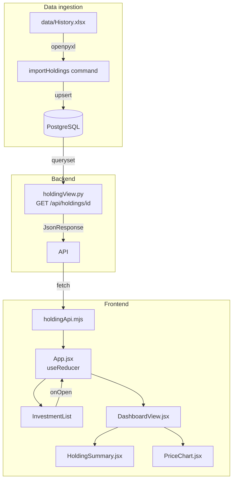

# Design Document — investment-dashboard

## Overview

The investment dashboard is a detail view for a single stock holding. It slots into the existing React SPA (`web/ui/`) and Django backend (`web/dashboard/`). Selecting a row in the Investment List opens the Dashboard View, which shows a summary panel of key facts (name, quantity, cost, value, gain/loss) alongside a line chart of the stock's closing price history. Data flows from an Interactive Investor `.xlsx` export → Django management command → PostgreSQL → JSON API → React components.

### Key design decisions

| Decision | Choice | Rationale |
|---|---|---|
| Chart library | **Recharts 3.x** | SVG-native, composable React components, React 19 confirmed working in v3.0 (released June 2025). Fits the project's declarative JSX style better than canvas-based Chart.js. |
| API approach | **Plain Django JSON views** | No DRF installed; the surface is a single endpoint. Plain `JsonResponse` views keep the dependency footprint small and are straightforward to test. |
| Price series source | **Import-time snapshot only** | The `.xlsx` export contains a portfolio snapshot, not a price history. The importer stores the book-cost price and the current market price as a two-point series (purchase date → import date). A full historical series would require a third-party data feed and is out of scope for this MVP. |
| `currentValue` | **Derived from exported market value column** | Interactive Investor exports include a "Value (£)" column. This is used directly and stored on the `Holding` record as `currentValue`. |
| Python naming | **camelCase** | Follows the project's established convention (see `python-standards` steering). |

---

## Architecture



The SPA uses a single top-level `useReducer` in `App.jsx`. The current view (list vs dashboard) is part of that reducer's state. There is no client-side router; a simple `view` discriminant in the state switches between the two screens.

---

## Components and Interfaces

### Frontend component tree

```
App
├── HeaderBar            (unchanged)
├── InvestmentList       (add onOpen prop, wire up "Open" button in Investment row)
│   └── Investment       (add "Open" button column)
└── DashboardView        (new)
    ├── HoldingSummary   (new)
    └── PriceChart       (new)
```

### `Investment.jsx` — add Open button

The existing "Run" button pattern is reused. A second action button labelled **"Open"** is added to the `<td>` actions cell:

```jsx
// Props added: onOpen?: (name: string) => void
<Button variant="outline-secondary" size="sm" onClick={() => onOpen?.(name)}>
  <FontAwesomeIcon icon={faFolderOpen} className="me-1" aria-hidden="true" />
  Open
</Button>
```

The button carries no additional `aria-label`; the `<th scope="row">` for the investment name already provides the row context (same reasoning as the existing "Run" button).

A `ref` prop is added so `App` can programmatically return focus when the Dashboard View closes (Req 5.4). The `Investment` component accepts `openRef?: React.RefObject<HTMLButtonElement>` and attaches it to the Open button.

### `DashboardView.jsx` — new component

```
Props:
  holdingId: number        — the id of the holding to display
  holdingName: string      — pre-known name (for the back button label, avoids blank while loading)
  onBack: () => void       — called when Back is activated

State (local, via useState):
  detail: HoldingDetail | null
  loading: boolean
  error: string | null

On mount: fetch GET /api/holdings/{holdingId}/
```

Renders:
- A `<Button variant="outline-secondary" onClick={onBack}>← Back</Button>` at the top.
- `<HoldingSummary>` fed from `detail` once loaded.
- `<PriceChart>` fed from `detail.priceSeries` once loaded.

### `HoldingSummary.jsx` — new component

```
Props:
  detail: HoldingDetail | null
  loading: boolean
  error: string | null
```

Renders a Bootstrap `Card` with a definition-list layout (Bootstrap's `<dl>/<dt>/<dd>` or a two-column grid). Fields:

| Label | Value | Source |
|---|---|---|
| Stock | name | `detail.name` |
| Quantity | integer | `detail.quantity` |
| Purchase Date | YYYY-MM-DD | `detail.purchaseDate` |
| Book Cost | £N.NN | `formatGbp(detail.bookCost)` |
| Current Value | £N.NN | `formatGbp(detail.currentValue)` |
| Gain / Loss | ±£N.NN (N.NN%) | `formatGainLoss(detail)` |

Unavailable fields render `—` (U+2014 em dash). Gain/Loss values are wrapped in a `<span>` coloured with Bootstrap's `text-success` / `text-danger` / default.

### `PriceChart.jsx` — new component

```
Props:
  priceSeries: Array<{ date: string, price: number }> | null
  stockName: string
  loading: boolean
  error: string | null
```

Uses Recharts `<LineChart>`. Key configuration:

```jsx
<ResponsiveContainer width="100%" height={300}>
  <LineChart data={priceSeries}>
    <XAxis
      dataKey="date"
      tickFormatter={formatChartDate}
      ticks={selectTicks(priceSeries, 12)}  // ≤ 12 ticks
    />
    <YAxis label={{ value: 'Price (GBp)', angle: -90, position: 'insideLeft' }} />
    <Tooltip formatter={(v) => [`${v} GBp`, 'Price']} />
    <Line type="monotone" dataKey="price" dot={false} />
  </LineChart>
</ResponsiveContainer>
```

The wrapping `<div>` carries:
```
aria-label={buildChartAriaLabel(stockName, priceSeries[0].date, priceSeries.at(-1).date)}
```

States: loading spinner, insufficient-data message, error message, chart.

### Pure formatter/utility functions — `holdingFormatters.mjs`

All pure functions live in a single module so they can be property-tested without mounting any React component:

```js
/**
 * Format a numeric GBP value: £N.NN, or '—' for null/undefined.
 * @param {number | null | undefined} value
 * @returns {string}
 */
export function formatGbp(value) { ... }

/**
 * Calculate gain/loss percentage.
 * ((currentValue - bookCost) / bookCost) × 100
 * Returns null when bookCost is 0 or unavailable.
 * @param {number} currentValue
 * @param {number} bookCost
 * @returns {number | null}
 */
export function calcGainLossPct(currentValue, bookCost) { ... }

/**
 * Format a gain/loss amount with sign prefix (+/−) and £.
 * Returns '—' when value is null/undefined.
 * @param {number | null | undefined} value
 * @returns {string}
 */
export function formatGainLossGbp(value) { ... }

/**
 * Return 'positive' | 'negative' | 'zero' for a gain/loss amount.
 * @param {number | null | undefined} value
 * @returns {'positive' | 'negative' | 'zero' | 'unavailable'}
 */
export function classifyGainLoss(value) { ... }

/**
 * Build the aria-label for the price chart.
 * @param {string} name
 * @param {string} startDate  YYYY-MM-DD
 * @param {string} endDate    YYYY-MM-DD
 * @returns {string}
 */
export function buildChartAriaLabel(name, startDate, endDate) { ... }

/**
 * Select up to maxTicks evenly-spaced ticks from a price series.
 * @param {Array<{ date: string }>} series
 * @param {number} maxTicks
 * @returns {string[]}
 */
export function selectTicks(series, maxTicks) { ... }
```

### `holdingApi.mjs` — new API client function

Added alongside the existing `listInvestments` in `api.mjs` (or a new sibling file):

```js
/**
 * @param {number} id
 * @returns {Promise<{ ok: true, detail: HoldingDetail } | { ok: false, message: string }>}
 */
export async function getHolding(id) { ... }
```

---

## Data Models

### Django models (`web/dashboard/models.py`)

```python
from django.db import models

class Holding(models.Model):
    """One stock position from an Interactive Investor export."""

    name         = models.CharField(max_length=255)
    quantity     = models.DecimalField(max_digits=18, decimal_places=6, null=True)
    purchaseDate = models.DateField(null=True)
    bookCost     = models.DecimalField(max_digits=18, decimal_places=2, null=True)
    currentValue = models.DecimalField(max_digits=18, decimal_places=2, null=True)
    importedAt   = models.DateTimeField(auto_now=True)

    class Meta:
        # Natural key: same stock acquired on the same date is one holding.
        unique_together = [('name', 'purchaseDate')]
        ordering = ['name']

    def __str__(self):
        return self.name


class PricePoint(models.Model):
    """One closing-price observation for a holding."""

    holding = models.ForeignKey(Holding, on_delete=models.CASCADE,
                                related_name='pricePoints')
    date    = models.DateField()
    price   = models.DecimalField(max_digits=12, decimal_places=2)

    class Meta:
        unique_together = [('holding', 'date')]
        ordering = ['date']

    def __str__(self):
        return f'{self.holding.name} @ {self.date}'
```

### API response shape

`GET /api/holdings/{id}/` → 200 OK:

```json
{
  "id": 1,
  "name": "VANGUARD FTSE ALL-WORLD ETF",
  "quantity": "12.345000",
  "purchaseDate": "2021-06-15",
  "bookCost": "1234.56",
  "currentValue": "1500.00",
  "priceSeries": [
    { "date": "2021-06-15", "price": "100.00" },
    { "date": "2025-07-10", "price": "121.56" }
  ]
}
```

Numeric fields are returned as strings (Python `Decimal` → JSON string) to avoid floating-point rounding at the transport layer. The frontend parser (`getHolding`) converts them to `number` via `parseFloat` before storing in state.

Error shapes (per Req 3.5, 3.6, 3.8):

```json
{ "detail": "Not found." }           // 404
{ "detail": "Invalid id." }          // 400
{ "detail": "<error description>" }  // 500
```

### Backend files

```
web/dashboard/
  models.py              — Holding, PricePoint (as above)
  holdingView.py         — getHolding(request, id) view function
  holdingSerializer.py   — serializeHolding(holding) → dict
  urls.py                — add path('api/holdings/<int:id>/', ...)
  management/
    commands/
      importHoldings.py  — Django management command
```

`web/app/urls.py` gains `path('api/', include('dashboard.urls'))`.

### `importHoldings.py` — management command

Column mapping from the Interactive Investor export (column names are matched case-insensitively after stripping whitespace):

| Source column | Model field |
|---|---|
| Stock | `name` |
| Quantity | `quantity` |
| Purchase price | `bookCost` / `quantity` → computed, or direct "Book cost (£)" column |
| Value (£) | `currentValue` |
| Purchase date | `purchaseDate` |

On each row:
1. Parse and validate all four required fields.
2. Skip the row (log row number + field name) if any field is invalid.
3. `update_or_create(defaults=..., name=name, purchaseDate=purchaseDate)`.
4. Create two `PricePoint` records: one for `purchaseDate` at the implied purchase price-per-share, and one for today at `currentValue / quantity`.
5. Log counts on completion.

---

## Correctness Properties

*A property is a characteristic or behavior that should hold true across all valid executions of a system — essentially, a formal statement about what the system should do. Properties serve as the bridge between human-readable specifications and machine-verifiable correctness guarantees.*

### Property 1: GBP currency formatter shape

*For any* finite numeric value, `formatGbp(value)` shall return a string that starts with the `£` character and contains exactly one `.` followed by exactly two digits.
**Validates: Requirements 1.4, 1.5, 1.6**

### Property 2: Gain/loss percentage formula

*For any* pair `(currentValue, bookCost)` where `bookCost` is a non-zero finite number, `calcGainLossPct(currentValue, bookCost)` shall return a value equal to `((currentValue - bookCost) / bookCost) × 100` to within floating-point rounding tolerance (1e-9).
**Validates: Requirement 1.7**

### Property 3: Gain/loss sign classifier

*For any* finite numeric `value`, `classifyGainLoss(value)` shall return `'positive'` if and only if `value > 0`, `'negative'` if and only if `value < 0`, and `'zero'` if and only if `value === 0`; and `formatGainLossGbp(value)` shall prefix the result with `+` when positive, `−` (U+2212) when negative, and no sign when zero.
**Validates: Requirements 1.8, 1.9, 1.10**

### Property 4: Null field placeholder

*For any* call to `formatGbp(value)` or `formatGainLossGbp(value)` where `value` is `null` or `undefined`, the return value shall be the string `'—'` (U+2014).
**Validates: Requirement 1.11**

### Property 5: Chart aria-label template

*For any* non-empty strings `name`, `startDate`, `endDate`, `buildChartAriaLabel(name, startDate, endDate)` shall return a string equal to `"Stock price chart for " + name + " from " + startDate + " to " + endDate`.
**Validates: Requirement 2.8**

### Property 6: Tick count bound

*For any* price series of any length ≥ 0 and any `maxTicks` ≥ 1, `selectTicks(series, maxTicks)` shall return an array whose length is at most `maxTicks` and at most `series.length`.
**Validates: Requirement 2.10**

### Property 7: Insufficient-data guard

*For any* price series whose length is 0 or 1, the `PriceChart` component shall not render an SVG chart element and shall render a text node matching `"Not enough price data to display a chart"`.
**Validates: Requirement 2.7**

### Property 8: Holding serialiser shape

*For any* `Holding` model instance (including one with no associated `PricePoint` records), `serializeHolding(holding)` shall return a dict containing exactly the keys `id`, `name`, `quantity`, `purchaseDate`, `bookCost`, `currentValue`, `priceSeries`; `priceSeries` shall be a list; and each entry in `priceSeries` shall contain a `date` key (string matching `YYYY-MM-DD`) and a `price` key (non-negative numeric string).
**Validates: Requirements 3.2, 3.3, 3.7**

### Property 9: Price series ordering

*For any* `Holding` instance with one or more associated `PricePoint` records, the `priceSeries` list returned by `serializeHolding` shall be ordered by `date` in strictly ascending order.
**Validates: Requirement 3.4**

### Property 10: API id validator

*For any* string that is not a representation of a positive integer (e.g. `"0"`, `"-1"`, `"abc"`, `"1.5"`, `""`), the id validator used in `holdingView` shall classify it as invalid and the view shall return HTTP 400 with `{"detail": "Invalid id."}`.
**Validates: Requirement 3.8**

### Property 11: Row field validator

*For any* import row dict where the value of `quantity`, `bookCost`, or `purchaseDate` is not parseable as the expected type, `validateRow(row)` shall return an error result that identifies the field name and the row index, and shall not raise an exception.
**Validates: Requirement 4.6**

---

## Error Handling

### Frontend

| Condition | Behaviour |
|---|---|
| `getHolding` network timeout | Show error message in `DashboardView`: "Failed to load holding data" |
| `getHolding` HTTP 404 | Show "Holding not found." and offer Back control |
| `getHolding` HTTP 500 | Show server's `detail` string, or fallback message |
| `priceSeries` < 2 points | Show "Not enough price data to display a chart" in `PriceChart` |
| `priceSeries` fetch error | Show "Failed to load price data" in `PriceChart` |
| Unavailable field | `formatGbp(null)` → `'—'`; derived fields also show `'—'` |

Loading and error states are modelled in `DashboardView`'s local state, mirroring the `listLoading` / `listError` pattern in `App.jsx`.

### Backend

| Condition | Response |
|---|---|
| `id` not a positive integer | 400 `{"detail": "Invalid id."}` |
| `Holding.DoesNotExist` | 404 `{"detail": "Not found."}` |
| Unexpected exception | 500 `{"detail": str(e)}` (caught in a broad `except Exception`) |

### Data importer

- Missing required column → log error naming the column, halt the file, exit non-zero.
- Row with unparseable field → log row number + field name, skip row, continue.
- File open failure → log filename, halt the file, exit non-zero.
- Successful run → log `"Created: N, Updated: M"`.

---

## Testing Strategy

### Unit tests (example-based)

Vitest for the frontend; Django's `TestCase` for the backend.

**Frontend (example-based)**
- `HoldingSummary` renders `—` for each null field in isolation.
- `PriceChart` renders the loading spinner when `loading=true`.
- `PriceChart` renders the error message when `error` is set.
- `DashboardView` calls `onBack` when the Back button is clicked.
- `App` reducer: `HOLDING_LOAD_STARTED`, `HOLDING_LOAD_SUCCEEDED`, `HOLDING_LOAD_FAILED` transitions.

**Backend (example-based)**
- `getHolding` view returns 404 for an unknown id.
- `getHolding` view returns 400 for non-integer id `"abc"`.
- `getHolding` view returns the full JSON shape for a known holding with two price points.
- `importHoldings` command: missing column halts the file.
- `importHoldings` command: a second run on the same file updates rather than duplicates.

### Property-based tests (fast-check / Hypothesis)

**Frontend — fast-check (already in `devDependencies`)**

Each property test runs with a minimum of 100 samples.

```
// Feature: investment-dashboard, Property 1: GBP currency formatter shape
fc.assert(fc.property(fc.float({ noNaN: true, noDefaultInfinity: true }), (v) => {
  const s = formatGbp(v);
  return s.startsWith('£') && /£\d+\.\d{2}$/.test(s);
}));
```

Property 2 follows the same pattern using `fc.float`.
**Validates: Requirement 1.7**

Property 3 follows the same pattern using `fc.float`.
**Validates: Requirements 1.8, 1.9, 1.10**

Property 4 follows the same pattern using `fc.float`.
**Validates: Requirement 1.11**

Property 5 follows the same pattern using `fc.string`.
**Validates: Requirement 2.8**

Property 6 follows the same pattern using `fc.array`.
**Validates: Requirement 2.10**

Property 7 follows the same pattern using `fc.array`.
**Validates: Requirement 2.7**

**Backend — Hypothesis**

```python
# Feature: investment-dashboard, Property 8: Holding serialiser shape
@given(st.builds(Holding, name=st.text(min_size=1), ...))
def test_serializeHolding_shape(holding):
    result = serializeHolding(holding)
    assert set(result.keys()) == {'id', 'name', 'quantity', 'purchaseDate',
                                   'bookCost', 'currentValue', 'priceSeries'}
```

Property 9 uses Hypothesis with `st.builds` and `st.integers`.
**Validates: Requirement 3.4**

Property 10 uses Hypothesis with `st.text` and `st.integers`.
**Validates: Requirement 3.8**

Property 11 uses Hypothesis with `st.builds` and `st.text`.
**Validates: Requirement 4.6**

Hypothesis must be added to the Conda environment:

```bash
conda install hypothesis
```

### Integration tests

- `GET /api/holdings/{id}/` end-to-end with a seeded test database (Django `TestCase` with `setUp` creating a `Holding` + two `PricePoint` rows).
- `importHoldings` command reading a minimal synthetic `.xlsx` file fixture.
- `DashboardView` mount in Vitest + jsdom: fetches mock data, renders summary + chart (using Vitest's `vi.mock` to stub `getHolding`).

### Storybook stories

New stories alongside existing ones:
- `DashboardView.stories.jsx` — loading, loaded, error states.
- `HoldingSummary.stories.jsx` — full data, null fields, positive/negative/zero gain.
- `PriceChart.stories.jsx` — loading, 0 points, 1 point, 2 points, 30 points, 365 points.
